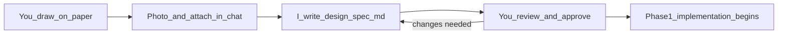
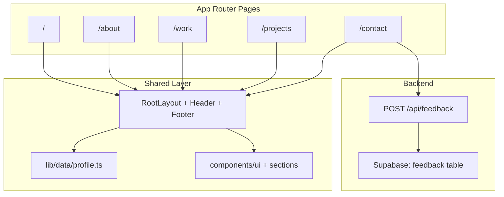
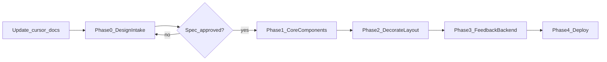

# Job-Seeking Profile Website — Project Plan

## Current State

- Fresh scaffold: Next.js **16.2.10**, React 19, Tailwind **4**, default starter page in `[app/page.tsx](app/page.tsx)`
- No custom components, content, or API routes yet
- `[.cursor/rules/cursorrules-cursor-ai-nextjs-14-tailwind-seo-setup.mdc](.cursor/rules/cursorrules-cursor-ai-nextjs-14-tailwind-seo-setup.mdc)` references **Next.js 14** (outdated vs actual stack)
- `[.cursor/plans/](.cursor/plans/)` does not exist yet — this plan will be saved there on execution
- **No Figma** — design source is paper wireframes; code follows an approved written spec, not assumptions

## Paper Wireframe Workflow (How to Show Me Your Design)

You draw on paper — that works well. Cursor chat accepts **images**, so you can attach photos of your sketches directly.

### What to photograph


| Item                      | Recommendation                                                                            |
| ------------------------- | ----------------------------------------------------------------------------------------- |
| **One sheet per page**    | Home, About, Work, Projects, Contact — one photo each (clearest)                          |
| **Or one overview sheet** | All 5 pages as small boxes on one page, plus detail sheets for complex pages              |
| **Breakpoints**           | If mobile layout differs, draw a second sketch labeled "mobile" and photograph separately |
| **Navigation flow**       | Optional: one sheet with arrows showing how pages link to each other                      |


### Photo tips (so I read your sketch accurately)

1. **Flat & well-lit** — place paper on a desk, shoot from directly above; avoid shadows
2. **Full frame** — all four corners of the paper visible
3. **Legible labels** — write page name ("About"), section names ("Education", "Certs"), and element labels ("nav", "button", "image")
4. **Number ambiguous boxes** — if unsure, circle and number them; explain in a short caption when you send
5. **Mark proportions** — simple notes like "image 2/3 width" or "sidebar 30%" help a lot
6. **Color notes** — write "amber heading", "amber button" on the sketch if you care about specific elements

### What to send in chat (along with photos)

A short message per page is enough, for example:

```
About page wireframe attached.
- Top: fixed header with logo left, nav right
- Main: photo left (1/3), summary text right (2/3)
- Below: personality as 3 pills, then education list, then certs
- Mobile: stack everything vertically
```

You do **not** need Figma, precise pixels, or design software.

### What I will do with your wireframes

1. **Read** each photo and your captions
2. **Ask 1–2 clarifying questions** only if something is ambiguous (via chat)
3. **Write** `[.cursor/plans/design-spec.md](.cursor/plans/design-spec.md)` — a plain-English design document covering:
  - Layout per page (regions, order, proportions)
  - Styles (amber usage, typography sizes, spacing rhythm)
  - Navigation and user workflow (how visitors move through the site)
  - Responsive behavior (what changes at mobile / tablet / desktop)
  - Component list mapped to your boxes
4. **Wait for your approval** — you reply "approved" or request changes
5. **Only then** start Phase 1 coding — wireframes are the source of truth, not generic portfolio templates




## Phase 0 — Design Intake (Required Before Coding)

**Goal:** Full shared understanding of layout, styles, and workflow before any component is built.

### Deliverable: `[.cursor/plans/design-spec.md](.cursor/plans/design-spec.md)`

This document will be structured as follows (filled in from your wireframes):

#### 1. Site map & user workflow

- Routes: `/`, `/about`, `/work`, `/projects`, `/contact`
- How the home page introduces and links to other pages
- Expected visitor journey (e.g. Home → Projects → Contact)

#### 2. Global layout (from your wireframe)

- Footer: content and links
- Page container width and horizontal padding
- Mobile nav pattern (hamburger, drawer, etc.) — **from your sketch, not assumed**

#### 3. Per-page layout breakdown

For each page, a labeled diagram in text:

```
┌─────────────────────────────────┐
│ Header (fixed)                  │
├─────────────────────────────────┤
│ [ region A — proportion ]       │
│ [ region B — proportion ]       │
│ ...                             │
├─────────────────────────────────┤
│ Footer                          │
└─────────────────────────────────┘
```

Plus: element list, reading order, and what is clickable.

#### 4. Style decisions (from your wireframe + amber preference)

- Where `.text-amber` / amber accents appear (headings, links, buttons, borders)
- Fixed font sizes per element type (h1, body, button, caption)
- Spacing between sections (your proportions, translated to Tailwind spacing scale)
- Card/button shape (rounded corners, borders, shadows) as drawn

#### 5. Responsive rules

- What stacks, hides, or resizes at each breakpoint — **explicitly tied to your mobile sketch if provided**
- If no mobile sketch: I will propose defaults in the spec and mark them **"assumed — please confirm"**

#### 6. Component map

Wireframe box → React component name (e.g. "projects grid" → `ProjectGrid` + `ProjectCard`)

### Approval gate


| Status       | Meaning                                                            |
| ------------ | ------------------------------------------------------------------ |
| **Draft**    | Spec written from wireframes; awaiting your review                 |
| **Approved** | You confirmed layout, styles, and workflow — coding may start      |
| **Revise**   | You send updated sketch or notes; spec is updated and re-submitted |


**No Phase 1 work until status is Approved.**

## Architecture Overview




## Design System

### Color — Amber Majority (60-30-10)


| Role                       | Tailwind classes                                       |
| -------------------------- | ------------------------------------------------------ |
| Background (60%)           | `bg-stone-50`, `dark:bg-stone-950`                     |
| Primary text / brand (30%) | `text-amber-700`, `dark:text-amber-400`                |
| Accents / CTAs (10%)       | `bg-amber-500`, `hover:bg-amber-600`, `text-amber-950` |
| Muted body                 | `text-stone-600`, `dark:text-stone-400`                |
| Borders                    | `border-amber-200`, `dark:border-amber-800`            |


Define reusable utility groups in `[app/globals.css](app/globals.css)`:

```css
.text-amber { @apply text-amber-700 dark:text-amber-400; }
.text-amber-muted { @apply text-amber-600/80 dark:text-amber-300/80; }
.btn-amber { @apply bg-amber-500 text-amber-950 font-medium rounded-lg px-4 py-2 hover:bg-amber-600 focus-visible:ring-2 focus-visible:ring-amber-400; }
```

### Typography — Fixed Scale (no fluid `clamp`)

Per your preference for fixed text/button sizing:

- Load one sans font via `next/font` in `[app/layout.tsx](app/layout.tsx)` (keep Geist or switch to Inter)
- Apply **fixed Tailwind sizes only** — `text-sm`, `text-base`, `text-lg`, `text-2xl`, etc. — no viewport-based font scaling
- Buttons: always `text-sm` or `text-base` with fixed `h-10` / `h-12` heights
- Headings: `text-2xl` (mobile) → `md:text-3xl` / `lg:text-4xl` for **layout** breakpoints only, not fluid type

### Responsive Layout — Defined in Phase 0, Not Assumed

Proportions, grids, and breakpoint behavior are **not preset**. They will be captured in `[design-spec.md](.cursor/plans/design-spec.md)` from your paper wireframes.

Fallback defaults (used only where your sketch is silent, and marked **"assumed — confirm"** in the spec):


| Breakpoint      | Container         | Section padding | Grid                       |
| --------------- | ----------------- | --------------- | -------------------------- |
| Mobile (<768px) | `max-w-full px-4` | `py-12`         | 1 column                   |
| Tablet (`md:`)  | `max-w-3xl px-6`  | `py-16`         | 2 columns where applicable |
| Desktop (`lg:`) | `max-w-5xl px-8`  | `py-20`         | 2–3 columns                |
| Wide (`xl:`)    | `max-w-6xl`       | `py-24`         | 3 columns (projects grid)  |


## File Structure (to create)

```
app/
  layout.tsx              # shared shell, nav, metadata
  page.tsx                # hero / landing with CTA links
  about/page.tsx
  work/page.tsx
  projects/page.tsx
  contact/page.tsx
  api/feedback/route.ts   # POST handler
  loading.tsx             # optional global loading
  error.tsx               # global error boundary
components/
  layout/
    Header.tsx            # nav links: About, Work, Projects, Contact
    Footer.tsx
    PageShell.tsx         # max-width container wrapper
  sections/
    AboutSummary.tsx
    EducationList.tsx
    CertificationList.tsx
    WorkExperience.tsx
    ProjectGrid.tsx
    ProjectCard.tsx
    ContactForm.tsx
    SocialLinks.tsx
  ui/
    Button.tsx
    SectionHeading.tsx
    Badge.tsx
lib/
  data/
    profile.ts            # all static content (typed)
  db/
    supabase.ts           # server client
    feedback.ts           # insert + list helpers
  validations/
    feedback.ts           # Zod schema
public/
  projects/               # 6 project images
supabase/
  migrations/
    001_feedback.sql      # feedback table schema
```

## Phase 1 — Core Components

**Prerequisite:** `[design-spec.md](.cursor/plans/design-spec.md)` status = **Approved**.

**Goal:** Typed content layer + reusable shells; pages match the approved wireframe layout (not a generic template).

1. **Content model** — `[lib/data/profile.ts](lib/data/profile.ts)`

```ts
export interface Profile {
  name: string;
  tagline: string;
  about: { summary: string; personality: string[]; education: Education[]; certifications: Certification[] };
  work: WorkEntry[];
  projects: Project[]; // exactly 6
  contact: { phone: string; email: string; github: string; linkedin: string };
}
```

1. **Layout components**
  - `Header` — active-link highlighting via `usePathname` (Client Component)
  - `PageShell` — consistent `max-w-*` + section spacing
  - `Footer` — copyright + social links
2. **Section components** — server components by default; accept data props from `profile.ts`
3. **Pages** — structure and region order follow `design-spec.md` per route:
  - `/`, `/about`, `/work`, `/projects`, `/contact` — layout as drawn on your wireframes
  - Placeholder copy until real content is provided
4. **Metadata** — per-page `export const metadata` for SEO (job-seeking keywords)

## Phase 2 — Decorate Layout & Function

**Goal:** Visual polish exactly as specified in `design-spec.md` — amber theme, spacing, images, interactions.

1. Apply amber classes per spec (which elements get `.text-amber`, `.btn-amber`, borders)
2. Match fixed typography sizes from spec (no deviations unless you request)
3. Add 6 project images under `public/projects/` (placeholders until real assets)
4. Build section components to match wireframe boxes (cards, timeline, form layout)
5. Mobile nav pattern **as drawn** — not a default hamburger unless your sketch shows one
6. Accessibility — semantic landmarks, focus rings, form labels, alt text
7. Responsive testing per `[.cursor/skills/responsive-testing.md](.cursor/skills/responsive-testing.md)` — compare result to wireframe photos

## Phase 3 — Feedback Backend (Supabase)

**Status: Completed** (2026-07-14)

Implemented with approved adaptations: `contacts` table (message-only), `CommentSection` wired to `POST /api/feedback`, lazy Supabase init for CI, Vitest unit tests.

**Goal:** Visitors submit feedback; data persists in database.

### Database schema

```sql
create table feedback (
  id uuid primary key default gen_random_uuid(),
  name text not null,
  email text not null,
  message text not null,
  created_at timestamptz default now()
);
enable row level security on feedback;
-- policy: anon INSERT only; SELECT restricted to service role
```

### API route — `[app/api/feedback/route.ts](app/api/feedback/route.ts)`

- `POST` — validate body with Zod (`name`, `email`, `message`)
- Insert via Supabase server client using `SUPABASE_SERVICE_ROLE_KEY`
- Return `{ success: true }` or `{ error: string }` with appropriate status codes
- Rate-limit consideration: basic honeypot field in form (no extra dependency)

### Contact form — `[components/sections/ContactForm.tsx](components/sections/ContactForm.tsx)`

- Client Component with controlled inputs, loading/error/success states
- `fetch('/api/feedback', { method: 'POST', ... })`

### Environment variables (`.env.local`)

```
NEXT_PUBLIC_SUPABASE_URL=
NEXT_PUBLIC_SUPABASE_ANON_KEY=
SUPABASE_SERVICE_ROLE_KEY=
```

### Optional admin view (stretch)

- `/admin/feedback` protected by simple `ADMIN_SECRET` env + middleware — list submissions. Defer unless you want it in v1.

### Dependencies to add

- `@supabase/supabase-js`
- `zod`

## Phase 4 — Deployment

1. **Supabase** — create project, run migration, copy env vars
2. **Vercel** — connect repo, set env vars, deploy
3. **Post-deploy checks**
  - All 5 routes render
  - Feedback form submits and row appears in Supabase
  - Lighthouse / metadata sanity check
4. Update `[README.md](README.md)` with setup instructions (env vars, dev commands)

## `.cursor` Documentation Adjustments

On execution, create/update these files:

### 1. Create `[.cursor/plans/profile-website.md](.cursor/plans/profile-website.md)`

Save this full plan as the canonical project reference.

### 2. Update rule: Next.js 14 → 16

Rename/update `[.cursor/rules/cursorrules-cursor-ai-nextjs-14-tailwind-seo-setup.mdc](.cursor/rules/cursorrules-cursor-ai-nextjs-14-tailwind-seo-setup.mdc)`:

- Title: "Next.js 16 + Tailwind 4 + TypeScript"
- Reference App Router, Route Handlers, metadata API for Next 16
- Keep existing component conventions (named exports, interface props, Server Components default)
- Add note: read `node_modules/next/dist/docs/` per `[AGENTS.md](AGENTS.md)`

### 3. New project rule: `[.cursor/rules/profile-site-conventions.mdc](.cursor/rules/profile-site-conventions.mdc)`

```yaml
description: "Portfolio site conventions — amber theme, multi-page routes, content structure"
globs: app/**,components/**,lib/**
alwaysApply: true
```

Contents:

- Route map: `/`, `/about`, `/work`, `/projects`, `/contact`
- **Layout source of truth:** `.cursor/plans/design-spec.md` (from paper wireframes) — not generic templates
- Amber class groups (`.text-amber`, `.btn-amber`, etc.)
- Fixed typography — no fluid font sizes
- Content lives in `lib/data/profile.ts` — never hardcode copy in JSX
- Images in `public/projects/` via `next/image`
- Feedback via `POST /api/feedback` only
- No UI implementation until design spec is user-approved

### 4. Update `[.cursor/skills/using-ui-stack.md](.cursor/skills/using-ui-stack.md)`

Add project-specific override section:

- Primary accent: **amber** (not generic blue)
- Background: stone/neutral + amber text hierarchy
- This is a marketing/portfolio site — prioritize readability and contrast over dense UI

### 5. New skill: `[.cursor/skills/paper-wireframe-design.md](.cursor/skills/paper-wireframe-design.md)`

Guide for the paper wireframe → spec → code workflow:

- How to photograph and annotate sketches
- Phase 0 gate: no UI code until `design-spec.md` is approved
- When wireframes change: update spec first, then code
- Reference `design-spec.md` as layout source of truth (not Figma)

### 6. New skill: `[.cursor/skills/profile-content-updates.md](.cursor/skills/profile-content-updates.md)`

Guide for updating resume content without touching layout:

- Edit `lib/data/profile.ts` fields
- Add/replace images in `public/projects/`
- Update metadata in each page file

### 7. Keep unchanged (still useful)

- `[responsive-testing.md](.cursor/skills/responsive-testing.md)` — use after Phase 2
- `[visual-qa-testing.md](.cursor/skills/visual-qa-testing.md)` — final polish pass
- `[vercel-react-best-practices.md](.cursor/skills/vercel-react-best-practices.md)` — Server Components, image optimization

## Implementation Order (matches your workflow)




| Step    | Deliverable                                                            |
| ------- | ---------------------------------------------------------------------- |
| 0       | Save plan + update `.cursor` rules/skills + paper-wireframe skill      |
| **0.5** | **You send wireframe photos → I write `design-spec.md` → you approve** |
| 1       | Core components + 5 pages matching approved spec                       |
| 2       | Amber theme, images, responsive polish per spec                        |
| 3       | Supabase migration + API route + contact form                          |
| 4       | Vercel deploy + README env docs                                        |


## Content You'll Need to Provide

**Before Phase 0 (design):**

- Paper wireframe photos (see [Paper Wireframe Workflow](#paper-wireframe-workflow-how-to-show-me-your-design))
- Optional short captions per page

**Before Phase 2 polish, gather:**

- Personal summary, personality traits (3–5 bullets)
- Education entries + certifications
- Work history (company, role, dates, achievements)
- 6 projects: title, description, tech stack, image, optional URL
- Contact: phone, email, GitHub, LinkedIn URLs

Placeholders will be used until you supply real copy.

## Risks & Mitigations


| Risk                                           | Mitigation                                                               |
| ---------------------------------------------- | ------------------------------------------------------------------------ |
| Supabase RLS misconfiguration exposes feedback | INSERT-only for anon; SELECT via service role in API only                |
| Next 16 API differs from rule examples         | Rule update + consult `node_modules/next/dist/docs/`                     |
| Wireframe ambiguity                            | Ask clarifying questions; mark assumptions in spec for your confirmation |
| Responsive proportions unclear                 | Document assumptions in spec; never silently override your sketch        |
| Phone number public                            | Only render on Contact page; consider obfuscation if needed              |


## Success Criteria

- Approved `design-spec.md` accurately reflects your paper wireframes
- 5 routes live matching the spec — amber theme and fixed typography
- 6 projects displayed with optimized images
- Contact page shows phone, email, GitHub, LinkedIn + working feedback form
- Feedback rows stored in Supabase
- Deployed on Vercel with env vars configured
- `.cursor/plans/profile-website.md` + updated rules/skills committed

