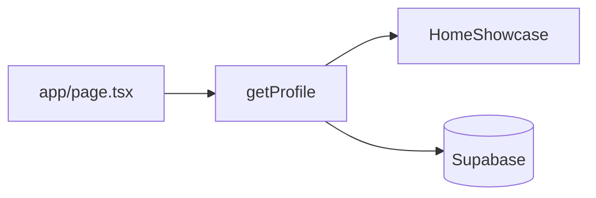

# My Web Profile

URL: https://my-web-profile-three.vercel.app/

A responsive, amber-themed personal portfolio built with **Next.js 16** (App Router), **React 19**, **TypeScript**, and **Tailwind CSS 4**. The home page is an interactive single-page showcase — visitors switch between About, Work, Project, and Contact panels without full page reloads.

## Website overview

| Route | Status | Purpose |
|-------|--------|---------|
| `/` | **Live** | Interactive showcase (`HomeShowcase`) — main portfolio experience |
| `/about` | Stub | Placeholder for future multi-page About layout |
| `/work` | Stub | Placeholder for future Work route |
| `/projects` | Stub | Placeholder for future Projects route |
| `/contact` | Stub | Placeholder for future Contact route |

The root layout wraps all pages with shared chrome (`PageShell`, `Footer`) and site-wide SEO metadata.

### Home showcase panels

| Panel | Content |
|-------|---------|
| **About** | Name, summary, avatar, tech stack groups, education and certification timelines |
| **Work** | Work experience timeline with bullets and skill tags |
| **Project** | Project portfolio timeline with links and descriptions |
| **Contact** | Phone, email, social links (GitHub, LinkedIn), and a visitor feedback form |

Navigation uses icon-driven `MainButton` components. Active panel state is managed client-side in `HomeShowcase`.

## Content

All visitor-facing copy and structured lists conform to the `ProfileData` type in `lib/data/profile.types.ts`:

- Bio: `name`, `tagline`, `summary`, optional `avatar` URL
- `techStackGroups` — labeled skill tag groups
- `education`, `certifications`, `work`, `projects` — `TimelineEntry[]` with date ranges, tags, and optional bullets/URLs
- `contact` — phone, email, `socialLinks` (`github` | `linkedin`)

Shared UI configuration (not personal copy) lives in `lib/data/profile.config.ts`:

- `mainNavItems` — panel labels and icon keys
- `responsiveSizeRules` — design-spec breakpoint notes for implementers

Profile picture fallback (when no `avatar` URL) comes from `components/profile_img/profileMap`.

Full type and field reference: [docs/profile-data.md](docs/profile-data.md).

## Functions

### Profile display

```
app/page.tsx (Server Component, force-dynamic)
  → getProfile(PROFILE_ID)          # lib/db/profile/getProfile.ts
  → HomeShowcase({ profile })       # Client Component
      → AboutPanel | WorkPanel | ProjectPanel | ContactPanel
```

Panels receive `profile` as a prop. They import types and nav config from `@/lib/data/profile` but do not query the database directly.

### Visitor feedback

```
ContactPanel → POST /api/feedback
  → Zod validation (feedbackBodySchema)
  → honeypot check (rejects bot submissions)
  → insertComment() → Supabase comments table
```

Returns `{ success: true }` on success or a safe error message with HTTP 400/500.

## Data source and handling

Live content is loaded from **Supabase** at request time.

| Env variable | Role |
|--------------|------|
| `NEXT_PUBLIC_SUPABASE_URL` | Supabase project URL |
| `SUPABASE_SERVICE_ROLE_KEY` | Server-only key for `getSupabase()` |
| `PROFILE_ID` | Which `profiles` row to load (optional default UUID) |

`getProfile()` queries these tables (filtered by `profile_id`):

`profiles` · `social_links` · `tech_stacks` · `educations` · `certifications` · `work_experiences` · `projects`

DB rows use snake_case columns; `mapRowsToProfileData()` converts them to camelCase `ProfileData`. Timeline rows are sorted newest-first. Unsupported social link IDs (e.g. `website`) are silently dropped.

Visitor messages are stored in the Supabase `contacts` / `comments` table via `insertComment()` (see `lib/db/comments/`).



## Error handling

| Area | Failure | Behavior |
|------|---------|----------|
| **Profile load** | Missing profile, query error, or bad env | `app/page.tsx` catches the error, passes `profile={null}`; `HomeShowcase` shows "Failed to fetch my data" with an error icon. Page does not crash. |
| **Profile load** | Missing Supabase env vars | `getSupabase()` throws `"Missing … environment variable."` — caught upstream as profile load failure. |
| **getProfile internals** | Any Supabase error | Throws generic `"Unable to load profile."` (no internal details leaked). |
| **Feedback POST** | Invalid JSON | `400` — `"Please enter a valid message before submitting."` |
| **Feedback POST** | Honeypot filled or Zod validation fail | `400` — same safe message |
| **Feedback POST** | Database insert failure | `500` — `"Unable to save feedback."` |
| **ContactPanel UI** | Submit result | Toast shows success or error state via `CommentSubmitStatus` |
| **Avatar** | No `profile.avatar` URL | `ProfilePicture` falls back to local `profileMap` image |

## Documentation

| Doc | Contents |
|-----|----------|
| [docs/instructions.md](docs/instructions.md) | Setup, env vars, scripts, deployment |
| [docs/profile-data.md](docs/profile-data.md) | Profile types, Supabase loader, pitfalls |
| [docs/cursor-development-workflow.md](docs/cursor-development-workflow.md) | How this site was built with Cursor (prep, phases 0–4, AI habits) |
| `.cursor/plans/design-spec.md` | Layout and visual design source of truth |

## Tech stack

Next.js 16 · React 19 · TypeScript · Tailwind CSS 4 · Supabase · Zod · Vitest
