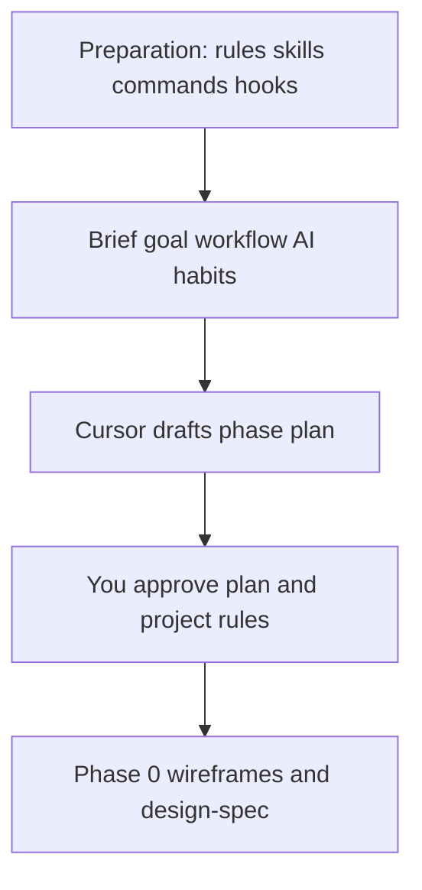

# Cursor Development Workflow

How this portfolio was built with **Cursor** — preparation, AI working habits, project-specific rules/skills/commands, and the phased delivery from paper wireframes through Supabase and Vercel.

This doc describes **process**, not runtime APIs. For setup and deploy commands, see [instructions.md](instructions.md). For profile data shapes and loaders, see [profile-data.md](profile-data.md).

## Overview

**What this covers**

This document outlines a repeatable way to use Cursor for this Next.js + Tailwind portfolio: set guardrails first, plan before coding, approve each phase, and then iterate with inline edits and chat.

**Why it exists**

- Keep layout and architecture decisions in files Cursor can re-read across chats
- Avoid large UI builds before the design is agreed
- Separate “think with me” (Plan mode) from “build it” (Agent mode)
- Capture SDLC checks (lint, tests, CI) as reusable skills/commands

**Key terms**

| Term | Meaning |
|------|---------|
| **Rule** (`.cursor/rules/*.mdc`) | Persistent instruction Cursor applies automatically (or by glob). Good for stack conventions and hard project constraints. |
| **Skill** (`.cursor/skills/**/SKILL.md`) | Named, invocable workflow Cursor follows for a specific job (UI stack, CI, wireframes, content updates). |
| **Command** (`.cursor/commands/*.md`) | Slash-command prompt templates (e.g. `/add-documentation`, `/code-review`) that steer a chat turn. |
| **Hook** (`.cursor/hooks.json` + `.cursor/hooks/*`) | Scripts or prompts that run on Cursor agent events (e.g. after a file edit, before a shell command, when a turn stops). Used to lint, audit, or block risky actions automatically. |
| **Plan** (`.cursor/plans/*.md`) | Written roadmap and design source of truth (`design-spec.md`, phase plan). |
| **Plan mode** | Read-only / planning-focused chat — clarify goals and draft steps before implementation. |
| **Agent mode** | Implementation mode — edits code after you approve the plan. |
| **Inline AI / chat** | Quick prompt bar or full chat for small adjustments without restarting the whole phase. |
| **Multitask / multi-agent** | Parallel agents for independent work (review, CI, explore) while you stay on the main thread. |
| **MCP** | Model Context Protocol — connects Cursor to external tools (here: Supabase) with structured actions. |
| **Phase gate** | No UI code until `design-spec.md` is approved; later phases build only after you approve the previous deliverable. |

## Preparation (before Phase 0)

### 1. Add external rules, skills, commands, and hooks

Start by installing or enabling Cursor extras from **external sources** (community packs, templates, Cursor docs/skills) that match the stack and how you want to work — then keep what fits this repo:

| Category | Examples in this repo | Role in general |
|----------|----------------------|-----------------|
| **Next.js + Tailwind rules** | `cursorrules-cursor-ai-nextjs-14-tailwind-seo-setup.mdc`, `profile-site-conventions.mdc` | Keep App Router, Server vs Client Components, Tailwind usage, SEO metadata, and site-specific constraints (amber theme, routes, content location) consistent. |
| **Explanation / mentoring** | `senior-to-junior-explanations.mdc` | Ask Cursor to explain *why*, map concepts to this project, and summarize what changed. |
| **UI skills** | `using-ui-stack`, `paper-wireframe-design`, `responsive-testing`, `visual-qa-testing`, `vercel-react-best-practices` | Design system consistency, wireframe → spec, breakpoint checks, visual QA, React performance patterns. |
| **SDLC / CI skills** | `ci-validate-and-fix`, `saving-workspace-context` | Run the same checks as GitHub Actions; persist decisions so later chats do not forget them. |
| **Cursor meta skills** | `suggesting-cursor-rules`, `suggesting-skills`, `suggesting-cursor-hooks` | When a correction or check repeats, turn it into a rule, skill, or hook. |
| **Commands** | `add-documentation`, `add-error-handling`, `code-review`, `write-unit-tests`, `optimize-performance`, `project-overview` | Slash shortcuts for docs, errors, review, tests, perf, and orientation. |
| **Hooks** (external) | `.cursor/hooks.json` plus scripts under `.cursor/hooks/` (`format-lint`, `audit-edits`, `block-risky-shell`, `stop-audit`, …) | Automate guardrails on agent events: lint/format after edits, audit changes, block risky shell commands, review the session when a turn stops. |

**Hooks preparation (external source)**

Hooks are not invented from scratch for this site — they come from an **external Cursor hooks setup** (shared template / create-hook guidance) and are copied or adapted into the project:

1. Bring in the external hook config and scripts (or follow the create-hook skill to install the same pattern).
2. Wire them in `.cursor/hooks.json` for events such as `afterFileEdit`, `beforeShellExecution`, and `stop`.
3. Keep scripts fast and repo-aware (e.g. lint only the edited file; deny force-push / secret exfiltration).
4. Later, use `suggesting-cursor-hooks` when you keep asking for the same check — extend the external base instead of redoing it by hand.

You do not need every community pack — pick what matches Next.js, Tailwind, UI work, CI, and agent safety. Project-specific rules/skills/hooks should override generic advice when they conflict.

### 2. Tell Cursor the goal, workflow, and AI habits

In an early chat (ideally Plan mode), brief Cursor with:

1. **Goal** — e.g. job-seeking portfolio on Next.js 16 + Tailwind 4, amber theme, interactive home showcase, Supabase later, Vercel deploy.
2. **Development workflow** — paper wireframes → written design spec → approved implementation phases → CI → deploy.
3. **Working habit with AI** (this project’s default):
   - New component, page, or API → **Plan mode first**
   - Cursor drafts a plan with phases and details
   - You **approve** before Agent mode builds
   - Tweaks via **inline AI prompt bar** or **chat** in Agent / multitask mode
4. **Project actions** — what is in scope now (e.g. Phase 0 design only) and what is deferred.

Cursor then drafts a plan document (here: `.cursor/plans/profile_website_plan_*.plan.md` and `.cursor/plans/profile-website.md`) with phases and acceptance criteria.

### 3. Ask Cursor to draft project rules, skills, and plans

After the goal is clear, ask Cursor to propose:

- **Rules** — stack + portfolio conventions (routes, amber, typography, content in `lib/data`, no UI before spec approval)
- **Skills** — wireframe intake, UI stack, responsive testing, CI validate-and-fix, profile content updates
- **Plans** — phase roadmap and `design-spec.md` template
- **SDLC** — align with `.github/workflows/ci.yml` (lint, typecheck, test, build)
- **Hooks** — keep the external hook base; only ask Cursor to adapt or extend it when a check keeps repeating

Review those drafts yourself. Approve or edit before treating them as source of truth. Conventions that survive review live under `.cursor/rules/` and `.cursor/skills/`; hooks stay under `.cursor/hooks.json` and `.cursor/hooks/`; the roadmap lives under `.cursor/plans/`.



## Working habit with AI (ongoing)

Use this loop for every new surface (component, page, route handler):

1. **Plan mode** — state the goal; Cursor outlines files, approach, and risks.
2. **Approve** — confirm Cursor understood layout, data flow, and constraints.
3. **Agent mode** — implement only the approved scope.
4. **Adjust** — small changes via inline AI or chat; larger direction changes → back to Plan mode.
5. **Optional multitask** — parallel agents for review, CI, or exploration while you stay focused on the main change.

**Why plan-first:** large UI and API work is expensive to undo. A short plan + approval catches wrong assumptions (wrong breakpoint, wrong data source, premature cards) before files multiply.

## Architecture of the Cursor setup

```
.cursor/
  rules/          # Always-on or glob-scoped conventions
  skills/         # Invocable workflows (UI, CI, wireframes, …)
  commands/       # Slash-command prompt templates
  hooks.json      # Agent event hooks (from external setup, adapted here)
  hooks/          # Hook scripts (lint, audit, shell safety, stop review)
  plans/          # design-spec.md + phase roadmap
docs/
  cursor-development-workflow.md   # this file
  instructions.md                  # npm / env / Vercel
  profile-data.md                  # ProfileData + getProfile
```

**Design decisions**

| Decision | Why |
|----------|-----|
| Paper wireframes → `design-spec.md` before UI | Layout source of truth without requiring Figma |
| Phase gates with human approval | Ensures shared understanding before code |
| Content in typed data / later Supabase | UI stays dumb; privacy and CI stay manageable |
| Project rules over generic AI taste | Avoids default “AI portfolio” layouts that fight the amber + wireframe design |
| Skills for CI and responsive checks | Same validation path locally as in GitHub Actions |
| Hooks from an external source | Reuse a proven agent safety/lint pattern; adapt paths and prompts to this repo instead of reinventing |

## Phase 0 — Design intake

**Goal:** Cursor understands core components and pages from your description and drawings — **no UI implementation yet**.

**What you provide**

- Short written description of each core component and page
- Photos or scans of paper wireframes (one sheet per page, or overview + detail sheets)
- Notes on mobile vs desktop when they differ
- Color / interaction hints (e.g. amber buttons, collapsible header)

**What Cursor does**

1. Reads images and captions
2. Asks clarifying questions only when ambiguous
3. Writes `.cursor/plans/design-spec.md` (layout, styles, nav flow, responsive behavior, component list)
4. **Waits for your approval**

**Gate:** Do not start Phase 1 until you approve `design-spec.md`. If the drawing changes later, update the spec first, then the code.

## Phase 1 — Core components (under approval)

**Goal:** Build shared building blocks and show them for review.

Typical deliverables after approval:

- Content types / profile data scaffolding (`lib/data/…`)
- Shared layout chrome (`PageShell`, header/nav patterns, `Footer`)
- Reusable primitives used across panels (e.g. buttons, timeline pieces, section shells)

**Your role:** Approve the Phase 1 plan, review the rendered UI, request adjustments via inline AI or chat before moving on.

**Cursor’s role:** Implement only what the approved spec calls for; keep long copy out of JSX (data layer).

## Phase 2 — Pages, widgets, and agile responsive design

**Goal:** Assemble webpages and widgets on top of core components; refine layouts across breakpoints with agile, approval-based tweaks.

After Phase 1 approval, Cursor builds route/page shells and home showcase widgets (`HomeShowcase`, About / Work / Project / Contact panels), then you iterate on responsive behavior.

### Agile responsive examples (this project)

These are real adjustment patterns used after first paint — not one-shot “perfect” layouts:

| Adjustment | Intent |
|------------|--------|
| **Initial empty → About** | First visit showed no panel content; changed so the About section appears by default. |
| **Timeline alignment** | Timeline sat left on all sizes; later centered on laptop and monitor widths. |
| **Header chrome** | Collapsible header with an arrow on small screens; on laptop/monitor, show a complete header box without the hide/show arrow. |

**Practice:** Prefer small, reviewable diffs per breakpoint change. Use skills like `responsive-testing` / `visual-qa-testing` when checking multiple widths. Update `design-spec.md` if the wireframe intent changed.

## Phase 3 — Supabase, feedback API, and safer profile loading

**Goal:** Connect a real backend for visitor comments and move profile data off static local files for better security and privacy.

**What you tell Cursor**

- Database platform: **Supabase**
- Enable / use the **Supabase MCP** so Cursor can work with the project in a structured way
- Product idea: visitors send a comment/feedback message to you
- Agile follow-up: stop treating local static profile files as the live source; **fetch profile via server-side API / `getProfile()`** instead

**What gets built (under approval)**

- Supabase tables and server access (`getSupabase()`, migrations as needed)
- `POST /api/feedback` with validation (Zod), honeypot, and insert into comments storage
- Contact UI wired to that route
- Home page loads profile with `getProfile(PROFILE_ID)` in a Server Component (env-based credentials; no service role in the browser)

**Documentation before Phase 4**

Before deploy, use the Cursor command **`/add-documentation`** (see `.cursor/commands/add-documentation.md`) to document the **whole project architecture** — routes, data flow (Supabase + static layer), feedback API, env vars, and this Cursor workflow — in `docs/` and keep [README.md](../README.md) linked.

**Privacy note:** Local `profile.local.ts` can remain for offline/CI samples; production personal data should come from Supabase with server-only keys. Never commit secrets; use `.env.local` / Vercel env vars.

## Phase 4 — Deploy on Vercel and keep iterating

**Goal:** Ship the site and continue adjusting with Cursor.

1. Connect the repo to [Vercel](https://vercel.com)
2. Set `NEXT_PUBLIC_SUPABASE_URL`, `SUPABASE_SERVICE_ROLE_KEY`, `PROFILE_ID`
3. Deploy (`npm run build` runs profile sync in CI)
4. Smoke-test the live URL (home panels, feedback form, error states)
5. Keep using Plan → approve → Agent for new features; use inline AI for polish

Live site reference: see the URL at the top of [README.md](../README.md).

## Examples — common chat prompts

**Start a new feature (Plan mode)**

```text
Plan mode: I want to add [component/page/API].
Follow design-spec.md and profile-site conventions.
Outline files, Server vs Client choice, and risks. Do not code until I approve.
```

**Approve and build**

```text
Approved. Implement Phase 2 header responsive behavior:
- mobile: collapsible header with arrow
- laptop/monitor: full header box, no toggle arrow
Show me the result when done.
```

**Phase 3 backend brief**

```text
We use Supabase. Enable Supabase MCP.
Create POST /api/feedback for visitor comments.
Migrate home profile load from local static data to getProfile() via the server for privacy.
Plan first, then wait for approval.
```

**Docs via command**

```text
/add-documentation
Update docs for the Cursor workflow / profile API changes we just made.
```

## Best practices

- **One phase at a time** — finish and approve before expanding scope
- **Spec before pixels** — wireframe or design-spec changes beat guessing in JSX
- **Data outside JSX** — profile copy in typed data / DB, not hardcoded in panels
- **Server for secrets** — Supabase service role and profile fetch stay on the server
- **Reuse project skills** — UI stack + CI validate after meaningful code changes
- **Document when behavior changes** — `/add-documentation` after API or workflow shifts

## Common pitfalls

| Pitfall | What to do instead |
|---------|-------------------|
| Coding UI before approving `design-spec.md` | Stop; finish Phase 0 |
| Huge Agent prompts with no plan | Plan mode → short approval → scoped Agent run |
| Putting personal profile secrets in git | Use Supabase + env vars; keep `*.local.ts` gitignored |
| Fixing CI only on GitHub | Run `ci-validate-and-fix` (or the same steps) locally |
| Responsive “one size” left over from mobile | Explicit laptop/monitor rules in the spec, then Tailwind `md:` / `lg:` |
| Forgetting to update docs after Phase 3 | `/add-documentation` into `docs/` and link from README |

## Related files

| Path | Role |
|------|------|
| `.cursor/plans/design-spec.md` | Approved layout / visual source of truth |
| `.cursor/plans/profile-website.md` | Phase roadmap summary |
| `.cursor/plans/profile_website_plan_*.plan.md` | Detailed Cursor plan with todos |
| `.cursor/rules/` | Next.js, Tailwind, site conventions |
| `.cursor/skills/` | UI, wireframe, CI, content workflows |
| `.cursor/commands/` | Slash commands including `/add-documentation` |
| `.cursor/hooks.json` + `.cursor/hooks/` | Agent hooks from external setup (lint, audit, shell safety, stop review) |
| [docs/instructions.md](instructions.md) | Setup, env, Vercel |
| [docs/profile-data.md](profile-data.md) | Profile types, `getProfile`, feedback API details |
