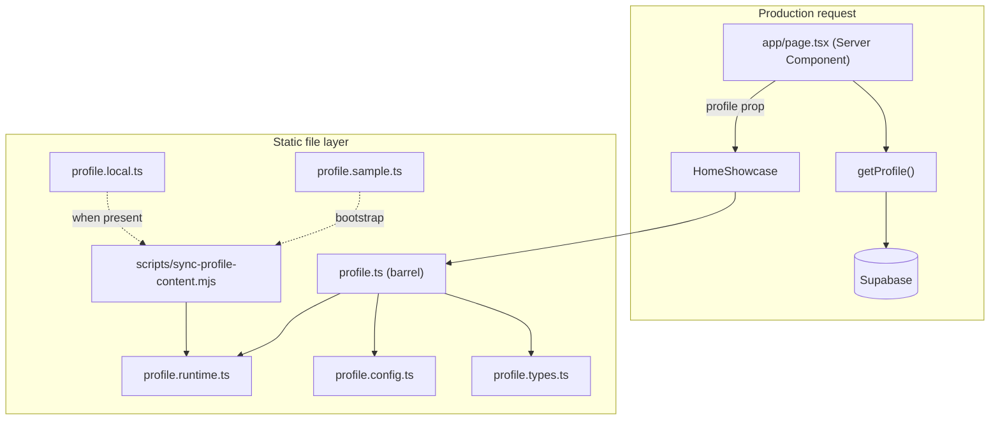

# Profile Data Layer

Centralized, typed content for the portfolio site. UI components render layout; this layer owns copy, timelines, contact details, and shared nav configuration.

## Overview

The home page loads live profile content from **Supabase** at request time. A parallel **static file layer** holds TypeScript types, nav config, sample placeholders, and optional local overrides for offline dev and CI.

**Why it exists**

- **Single source of truth** — one `ProfileData` shape for database rows and static files.
- **Type safety** — interfaces catch missing or mistyped fields at build time.
- **Separation of concerns** — panels receive `profile` as props; they do not query the database directly.
- **CI-friendly** — sample files bootstrap builds without secrets or personal data in git.
- **Local privacy** — personal copy and images stay gitignored.

**Key terms**

| Term | Meaning |
|------|---------|
| `ProfileData` | Root content object (bio, timelines, contact, optional avatar URL). |
| `getProfile()` | Server-only async loader that reads Supabase and returns `ProfileData`. |
| `profileData` | Static export in `profile.runtime.ts` (synced from local or sample; not used by the home page today). |
| `TimelineEntry` | A dated item (education, cert, job, or project). |
| `ShowcaseView` | One of four home panels: `about`, `work`, `project`, `contact`. |
| `mainNavItems` | Nav button config (labels + icon keys) for `HomeShowcase`. |
| `profileMap` | Default local profile image (`StaticImageData`) when no `avatar` URL is set. |
| `profile.local.ts` | Optional personal content override (gitignored). |
| `profile.runtime.ts` | Synced runtime copy imported by `profile.ts` (gitignored). |
| `profile.sample.ts` | Placeholder content committed for CI and first-time setup. |

## Architecture



**Design decisions**

- **Database for live content** — `app/page.tsx` calls `getProfile(PROFILE_ID)` so deployed content can change without redeploying TypeScript files.
- **Barrel export** — import types and config from `@/lib/data/profile`, not from internal modules (unless you are editing them).
- **Split files** — types and shared config stay committed; personal copy and runtime sync outputs are gitignored.
- **Sync script** — `npm run dev` and `npm run build` run `scripts/sync-profile-content.mjs` so local edits and CI always have a valid `profile.runtime.ts` and `profileMap.runtime.ts`.
- **Config vs content** — nav icons and responsive rules are structural; they live in `profile.config.ts`, not in personal data or the database.
- **Graceful failure** — if `getProfile()` throws, `HomeShowcase` receives `profile={null}` and shows an error state instead of crashing the page.

## File layout

```
lib/data/
  profile.ts            # Public API — types, config, static profileData export
  profile.types.ts      # TypeScript interfaces
  profile.config.ts     # Nav items + responsive size rules (committed)
  profile.sample.ts     # Sample content (committed)
  profile.local.ts      # Personal overrides (gitignored)
  profile.runtime.ts    # Synced runtime copy (gitignored)

lib/db/profile/
  getProfile.ts         # Supabase loader + row → ProfileData mapper

components/profile_img/
  profileMap.ts           # Barrel — import profileMap from here
  profileMap.sample.ts    # Placeholder image (committed)
  profileMap.local.ts     # Local image override (gitignored)
  profileMap.runtime.ts   # Synced runtime export (gitignored)
  *.png / *.svg           # Personal image assets (gitignored)

scripts/
  sync-profile-content.mjs  # Syncs .local.ts → .runtime.ts (or bootstraps from sample)
```

Import pattern for types and config:

```ts
import { mainNavItems, type ProfileData, type TimelineEntry } from "@/lib/data/profile";
```

## Database layer (production)

### Environment variables

| Variable | Required | Description |
|----------|----------|-------------|
| `NEXT_PUBLIC_SUPABASE_URL` | yes | Supabase project URL. |
| `SUPABASE_SERVICE_ROLE_KEY` | yes | Service role key (server-only; used by `getSupabase()`). |
| `PROFILE_ID` | no | UUID of the profile row. Defaults to `11111111-1111-1111-1111-111111111111`. |

Copy `.env.example` to `.env.local` and fill in values before running locally.

### `getProfile(profileId?: string): Promise<ProfileData>`

**Location:** `lib/db/profile/getProfile.ts` (marked `server-only`).

**Parameters**

| Name | Type | Default | Description |
|------|------|---------|-------------|
| `profileId` | `string` | `PROFILE_ID` env or default UUID | Which `profiles` row to load. |

**Returns** — a fully mapped `ProfileData` object.

**Throws** — generic `Error("Unable to load profile.")` when:

- The profile row is missing.
- Any related table query fails.
- Supabase env vars are missing (via `getSupabase()`).

**Related tables** (all filtered by `profile_id`):

| Table | Maps to |
|-------|---------|
| `profiles` | `name`, `tagline`, `summary`, `phone`, `email`, `avatar` |
| `social_links` | `contact.socialLinks` (only `github` and `linkedin` ids are kept) |
| `tech_stacks` | `techStackGroups` |
| `educations` | `education` |
| `certifications` | `certifications` |
| `work_experiences` | `work` |
| `projects` | `projects` |

Timeline rows are sorted **newest first** by start date, then end date (ongoing items sort as latest).

### `mapRowsToProfileData(rows): ProfileData`

Pure mapper used by `getProfile` and unit tests. Converts snake_case DB columns (`start_month`, `end_year`, etc.) to camelCase `ProfileData` fields.

**Edge cases**

| Scenario | Behavior |
|----------|----------|
| Unsupported `social_links.id` (e.g. `website`) | Silently dropped via `flatMap`. |
| `null` tags or bullets | Mapped to `[]`. |
| `null` subtitle or url | Omitted from the entry (`undefined`). |
| Ongoing role (`end_month` / `end_year` null) | `range` has only `startMonth` / `startYear`; UI shows `Present`. |
| `null` avatar | `avatar` omitted; `ProfilePicture` falls back to `profileMap`. |

### Server Component usage (home page)

```tsx
import type { ProfileData } from "@/lib/data/profile";
import { getProfile, PROFILE_ID } from "@/lib/db/profile/getProfile";

export const dynamic = "force-dynamic";

export default async function Home() {
  let profile: ProfileData | null = null;

  try {
    profile = await getProfile(PROFILE_ID);
  } catch {
    profile = null;
  }

  return <HomeShowcase profile={profile} />;
}
```

Panels receive `profile` as a prop — they do not import `profileData` directly.

## Static file layer API

### `profileData: ProfileData`

Exported from `profile.runtime.ts` via `profile.ts`. Used for static workflows, tooling, and tests. **Not** the production data path for `app/page.tsx`.

### `ProfileData` fields

| Field | Type | Required | Description |
|-------|------|----------|-------------|
| `name` | `string` | yes | Display name in About panel and metadata. |
| `tagline` | `string` | yes | Welcome line in the home hero. |
| `summary` | `string` | yes | About-panel bio paragraph. |
| `avatar` | `string` | no | Image URL from Supabase. Falls back to local `profileMap` when omitted. |
| `techStackGroups` | `{ label, tags[] }[]` | yes | Grouped skill tags for About. |
| `education` | `TimelineEntry[]` | yes | May be empty. |
| `certifications` | `TimelineEntry[]` | yes | May be empty. |
| `work` | `TimelineEntry[]` | yes | Work experience entries. |
| `projects` | `TimelineEntry[]` | yes | Project portfolio entries. |
| `contact` | object | yes | `phone`, `email`, `socialLinks`. |

### `TimelineEntry`

| Field | Type | Required | Description |
|-------|------|----------|-------------|
| `id` | `string` | yes | Stable unique key (e.g. `work-1`) — React key. |
| `title` | `string` | yes | Primary heading. |
| `subtitle` | `string` | no | Secondary line (employer, repo label, etc.). |
| `url` | `string` | no | External link (cert, repo, demo). |
| `bullets` | `string[]` | no | Achievement bullets for work/projects. |
| `tags` | `string[]` | no | Tech/skill chips. |
| `range` | `DateRange` | yes | Start/end dates for the timeline UI. |

### `DateRange`

| Field | Type | Required | Description |
|-------|------|----------|-------------|
| `startMonth` | `number` | yes | 1–12 |
| `startYear` | `number` | yes | Four-digit year |
| `endMonth` | `number` | no | Omit with `endYear` for ongoing roles (`Present`). |
| `endYear` | `number` | no | Omit for ongoing roles. |

### `SocialLink`

| Field | Type | Description |
|-------|------|-------------|
| `id` | `"github" \| "linkedin"` | Drives icon selection in Contact panel. |
| `label` | `string` | Accessible link text. |
| `href` | `string` | Full URL. |

### `mainNavItems: MainNavItem[]`

Fixed four-item nav for `HomeShowcase`. Each item maps a `ShowcaseView` to label and icon asset keys (`aboutWhite` / `aboutAmber`, etc.). Edit in `profile.config.ts` only if nav structure changes.

### `responsiveSizeRules: ResponsiveSizeRule[]`

Design-spec notes per component and breakpoint (`mobile`, `tablet`, `desktop`, `wide`). Reference for layout work — not consumed at runtime by components today.

### Re-exported types

`ShowcaseView`, `DateRange`, `TimelineEntry`, `SocialLink`, `MainNavItem`, `ProfileData`, `ResponsiveSizeRule` — defined in `profile.types.ts`, re-exported from `profile.ts`.

## Profile image map

Local fallback image when `profile.avatar` is not set.

```
components/profile_img/profileMap.ts  →  profileMap.runtime.ts
```

| File | Role |
|------|------|
| `profileMap.sample.ts` | Committed placeholder (`about_amber200.svg`). |
| `profileMap.local.ts` | Your image import (gitignored). |
| `profileMap.runtime.ts` | Synced export used at build time (gitignored). |

`ProfilePicture` defaults to `profileMap` when `src` is omitted:

```tsx
<ProfilePicture src={profile.avatar} alt={`${profile.name} profile picture`} />
```

Put personal image files (`.png`, `.svg`) in `components/profile_img/` — the folder is gitignored except `profileMap.sample.ts`.

## Local setup and CI

### First-time local dev

See [instructions.md](instructions.md) for full setup. Quick start:

```bash
cp lib/data/profile.sample.ts lib/data/profile.local.ts
cp components/profile_img/profileMap.sample.ts components/profile_img/profileMap.local.ts
```

Then edit `profile.local.ts` and configure `.env.local` for Supabase.

### Sync script behavior

`node scripts/sync-profile-content.mjs` runs automatically in `npm run dev`, `npm run build`, and CI.

For each content pair (profile data + profile map):

1. **`*.local.ts` exists** → copy to `*.runtime.ts` (local edits win).
2. **No local, no runtime** → bootstrap both from `*.sample.ts`.
3. **No local, runtime exists** → create local from sample; keep existing runtime.

### CI (`.github/workflows/ci.yml`)

1. `npm ci`
2. `node scripts/sync-profile-content.mjs`
3. lint, typecheck, test, build

CI does not need Supabase credentials for the build itself unless integration tests are added later. Runtime profile files are generated from samples during the sync step.

## Usage examples

### Panel component (receives profile prop)

```tsx
import type { ProfileData } from "@/lib/data/profile";
import { Timeline } from "@/components/ui/Timeline";

interface WorkPanelProps {
  profile: ProfileData;
}

export const WorkPanel = ({ profile }: WorkPanelProps) => (
  <Timeline entries={profile.work} />
);
```

### Nav config in a Client Component

```tsx
"use client";

import { mainNavItems, type ShowcaseView } from "@/lib/data/profile";

// mainNavItems drives MainButton labels and icons in HomeShowcase
```

### Static profileData (offline / tooling only)

```tsx
import { profileData } from "@/lib/data/profile";

// profileData comes from profile.runtime.ts after sync — not the live Supabase path
```

## Error handling summary

| Scenario | Behavior |
|----------|----------|
| Supabase unreachable or profile missing | `app/page.tsx` catches error; `HomeShowcase` shows "Failed to fetch my data". |
| Missing `profile.local.ts` on fresh clone | Sync script bootstraps from sample on first `npm run dev` or `npm run build`. |
| Missing Supabase env vars | `getSupabase()` throws at first `getProfile()` call. |
| Ongoing job/project | Omit `endMonth` and `endYear`; `Timeline` renders `Present`. |
| Single-month entry | Set same start/end month and year. |
| Empty timeline array | Valid; panel renders an empty timeline. |
| Invalid `SocialLink.id` in static files | TypeScript error (`github` \| `linkedin` only). |
| Unsupported social link in DB | Silently filtered out by `mapRowsToProfileData`. |
| Broken external URLs | No runtime validation; verify links manually. |

## Best practices

- **Production content** — update Supabase rows for the deployed site; use static files for local-only experiments.
- **Import from the barrel** — `@/lib/data/profile` for types and config.
- **Stable timeline ids** — keep `id` values consistent for React keys and future features.
- **Intentional ordering** — DB mapper sorts newest-first; static arrays should follow the same convention.
- **After content changes** — run `npm run dev`, check all four panels, contact links, and avatar fallback.
- **Do not hardcode long copy in JSX** — extend `ProfileData` or update the database instead.

## Common pitfalls

- **Editing `profile.ts` for content** — it only re-exports; edit `profile.local.ts` or Supabase rows.
- **Expecting `profileData` on the home page** — `app/page.tsx` uses `getProfile()`, not the static export.
- **Committing `profile.local.ts` or `profile.runtime.ts`** — gitignored by design.
- **Wrong date shape in static files** — months must be numbers 1–12, not strings.
- **Adding a third social network** — extend `SocialLink["id"]`, icons, `ContactPanel`, and DB seed data together.
- **Forgetting `.env.local`** — local `getProfile()` needs Supabase credentials.
- **Mixing avatar sources** — DB `avatar` URL overrides local `profileMap`; both can coexist intentionally.

## Related docs

- Layout and visual rules: `.cursor/plans/design-spec.md`
- Content update workflow: `.cursor/skills/profile-content-updates/SKILL.md`
- Project images: `public/projects/` (referenced by project UI, not stored inside `profileData`)
- Env template: `.env.example`
- Setup and scripts: [docs/instructions.md](instructions.md)
