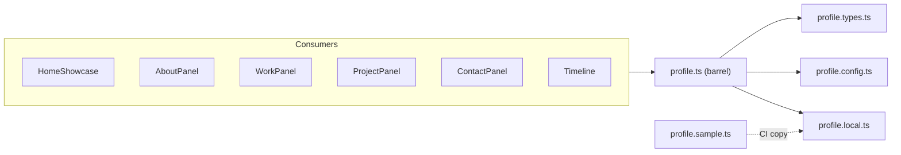

# Profile Data Layer

Centralized, typed content for the portfolio site. UI components read from this layer instead of hardcoding copy in JSX.

## Overview

The profile data layer stores everything a visitor sees: name, summary, tech stack, education, certifications, work history, projects, and contact details. It also exports shared UI configuration (main navigation items and responsive sizing rules).

**Why it exists**

- **Single source of truth** — update content in one place; all panels stay in sync.
- **Type safety** — `ProfileData` and related interfaces catch missing or mistyped fields at build time.
- **Separation of concerns** — section components render layout; this layer owns content.
- **CI-friendly** — personal content stays local; CI builds use a committed sample file.

**Key terms**

| Term | Meaning |
|------|---------|
| `profileData` | The main content object (bio, timelines, contact). |
| `TimelineEntry` | A dated item (education, cert, job, or project). |
| `ShowcaseView` | One of the four home panels: `about`, `work`, `project`, `contact`. |
| `mainNavItems` | Nav button config (labels + icon keys) for `HomeShowcase`. |
| `profile.local.ts` | Your personal content file (gitignored). |
| `profile.sample.ts` | Placeholder content committed for CI and onboarding. |

## File layout

```
lib/data/
  profile.ts          # Public API — import from here only
  profile.types.ts    # TypeScript interfaces
  profile.config.ts   # Nav items + responsive size rules (shared, committed)
  profile.local.ts    # Your real content (gitignored)
  profile.sample.ts   # Sample content (committed; copied in CI)
```

`profile.ts` is a **barrel file**: it re-exports types, config, and data so consumers use one import path:

```ts
import { profileData, type TimelineEntry } from "@/lib/data/profile";
```

## API reference

### `profileData: ProfileData`

Main content object. Shape:

| Field | Type | Required | Description |
|-------|------|----------|-------------|
| `name` | `string` | yes | Display name in header and metadata. |
| `tagline` | `string` | yes | Short welcome line on the home hero. |
| `summary` | `string` | yes | About-panel bio paragraph. |
| `techStackGroups` | `{ label, tags[] }[]` | yes | Grouped skill tags for the About panel. |
| `education` | `TimelineEntry[]` | yes | Education timeline (may be empty). |
| `certifications` | `TimelineEntry[]` | yes | Certifications timeline (may be empty). |
| `work` | `TimelineEntry[]` | yes | Work experience entries. |
| `projects` | `TimelineEntry[]` | yes | Project portfolio entries. |
| `contact` | object | yes | Phone, email, and social links. |

### `TimelineEntry`

| Field | Type | Required | Description |
|-------|------|----------|-------------|
| `id` | `string` | yes | Stable unique key (e.g. `work-1`). |
| `title` | `string` | yes | Primary heading. |
| `subtitle` | `string` | no | Secondary line (employer, repo label, etc.). |
| `url` | `string` | no | External link (cert, repo, demo). |
| `bullets` | `string[]` | no | Achievement bullets for work/projects. |
| `tags` | `string[]` | no | Tech/skill chips. |
| `range` | `DateRange` | yes | Start/end dates for the timeline UI. |

### `DateRange`

| Field | Type | Required | Description |
|-------|------|----------|-------------|
| `startMonth` | `number` | yes | 1–12 |
| `startYear` | `number` | yes | Four-digit year |
| `endMonth` | `number` | no | Omit with `endYear` for ongoing roles (`Present`). |
| `endYear` | `number` | no | Omit for ongoing roles. |

### `SocialLink`

| Field | Type | Description |
|-------|------|-------------|
| `id` | `"github" \| "linkedin"` | Drives icon selection in the Contact panel. |
| `label` | `string` | Accessible link text. |
| `href` | `string` | Full URL. |

### `mainNavItems: MainNavItem[]`

Fixed four-item nav for `HomeShowcase`. Each item maps a `ShowcaseView` to label and icon asset keys (`aboutWhite` / `aboutAmber`, etc.). Edit in `profile.config.ts` only if nav structure changes.

### `responsiveSizeRules: ResponsiveSizeRule[]`

Design-spec notes per component and breakpoint (`mobile`, `tablet`, `desktop`, `wide`). Reference for layout work—not consumed at runtime by components today.

### Re-exported types

`ShowcaseView`, `DateRange`, `TimelineEntry`, `SocialLink`, `MainNavItem`, `ProfileData`, `ResponsiveSizeRule` — all defined in `profile.types.ts` and re-exported from `profile.ts`.

## Usage examples

### Read content in a Server Component

```tsx
import { profileData } from "@/lib/data/profile";

export const AboutPanel = () => (
  <section>
    <p>{profileData.summary}</p>
  </section>
);
```

### Pass timeline data to a shared component

```tsx
import { profileData, type TimelineEntry } from "@/lib/data/profile";
import { Timeline } from "@/components/ui/Timeline";

const entries: TimelineEntry[] = profileData.work;

export const WorkPanel = () => <Timeline entries={entries} />;
```

### Use nav config in a Client Component

```tsx
"use client";

import { mainNavItems, type ShowcaseView } from "@/lib/data/profile";

// mainNavItems drives MainButton labels and icons in HomeShowcase
```

## Local setup and CI

1. **First-time local dev** — copy the sample to create your personal file:
   ```bash
   cp lib/data/profile.sample.ts lib/data/profile.local.ts
   ```
2. Edit `profile.local.ts` with your real content.
3. `profile.local.ts` is **gitignored** so personal details are not committed.
4. **CI** copies `profile.sample.ts` → `profile.local.ts` before lint, typecheck, and build (see `.github/workflows/ci.yml`).

Do not change the import in `profile.ts` unless you intentionally switch data sources.

## Error handling and edge cases

| Scenario | Behavior |
|----------|----------|
| Missing `profile.local.ts` on a fresh clone | Build fails until you copy from `profile.sample.ts`. |
| Ongoing job/project | Omit `endMonth` and `endYear`; `Timeline` renders `Present`. |
| Single-month entry | Set same start/end month and year; UI shows one date. |
| Empty timeline array | Valid; panel renders an empty timeline. |
| Invalid `SocialLink.id` | TypeScript error at compile time (only `github` \| `linkedin`). |
| Broken external URLs | No runtime validation; verify links manually after edits. |

## Architecture



**Design decisions**

- **Barrel export** — one import path (`@/lib/data/profile`) for all consumers.
- **Split files** — types and shared config stay committed; only personal copy is gitignored.
- **Sample for CI** — pipelines never need secrets or real PII in the repo.
- **Config vs content** — nav icons and responsive rules are structural; they live in `profile.config.ts`, not in personal data.

## Best practices

- Import from `@/lib/data/profile`, not from `profile.local.ts` or `profile.types.ts` directly (unless you are editing those modules).
- Keep long copy in `profileData`; use short labels in components.
- Use stable `id` values on timeline entries so keys and future features do not break.
- Order arrays intentionally (newest-first for projects/work is the current convention).
- After content changes, run `npm run dev` and spot-check all four panels plus contact links.

## Common pitfalls

- **Editing `profile.ts` for content** — it only re-exports; edit `profile.local.ts` instead.
- **Committing `profile.local.ts`** — it is gitignored by design; use `profile.sample.ts` for generic placeholders only.
- **Hardcoding strings in JSX** — violates project conventions; add fields to `ProfileData` if new copy is needed.
- **Wrong date shape** — months must be numbers 1–12, not strings.
- **Adding a third social network** — extend `SocialLink["id"]`, icons, and `ContactPanel` together; the type is intentionally narrow today.

## Related docs

- Layout and visual rules: `.cursor/plans/design-spec.md`
- Content update workflow: `.cursor/skills/profile-content-updates.md`
- Project images: `public/projects/` (referenced by project UI, not stored inside `profileData`)
